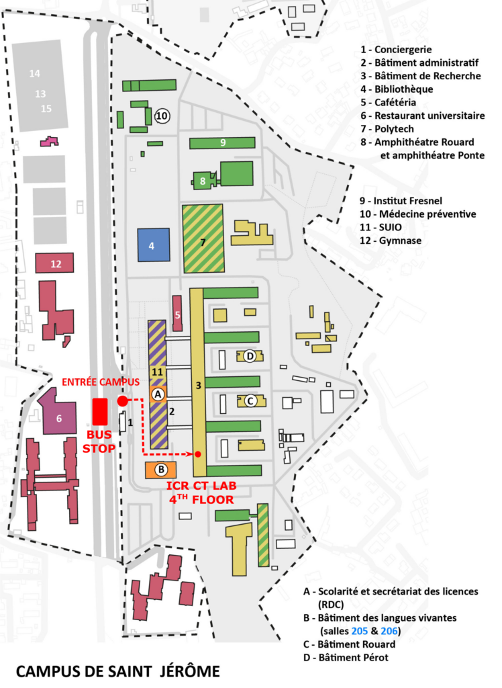

<h2>Miquel Huix-Rotllant</h2>

<strong>Institut de Chimie Radicalaire (ICR)</strong> 
Aix-Marseille Université, CNRS 
UMR 7273

📍 52 Avenue Escadrille Normandie-Niemen 
Entrance BJ5, Service D42 
13397 Marseille Cedex 20 
France

☎ +33 (0)4 13 94 58 81

✉ 
<a href="mailto:miquel.huix-rotllant@cnrs.fr">
miquel.huix-rotllant@cnrs.fr
</a>

<a href="https://orcid.org/0000-0002-2131-7328">
ORCID
</a>
 

<a href="https://scholar.google.com/citations?user=4-Y_V40AAAAJ">
Google Scholar
</a>
 

<a href="https://www.linkedin.com/in/huixrotllant/">
Linkedin</a>

<h2>Campus location</h2>

<h2>Access map</h2>

<iframe
style="border: 0;" src="https://www.google.com/maps/embed?pb=!1m28!1m12!1m3!1d23221.648198615985!2d5.388930239238843!3d43.32041306457023!2m3!1f0!2f0!3f0!3m2!1i1024!2i768!4f13.1!4m13!3e3!4m5!1s0x12c9c096e729d3b1%3A0xe27e4de8ab708ec5!2sGare+de+Marseille+Saint-Charles%2C+Square+Narvik%2C+13232+Marseille!3m2!1d43.3032794!2d5.380141999999999!4m5!1s0x12c9bf94988d315d%3A0x3f75d7f93a9e5c0!2sCampus+Universitaire+de+Saint-J%C3%A9r%C3%B4me%2C+52+Avenue+Escadrille+Normandie+Niemen%2C+13013+Marseille!3m2!1d43.336982299999995!2d5.4108503!5e0!3m2!1sfr!2sfr!4v1484064928911" width="600" height="500" frameborder="0" allowfullscreen="allowfullscreen">
</iframe>

